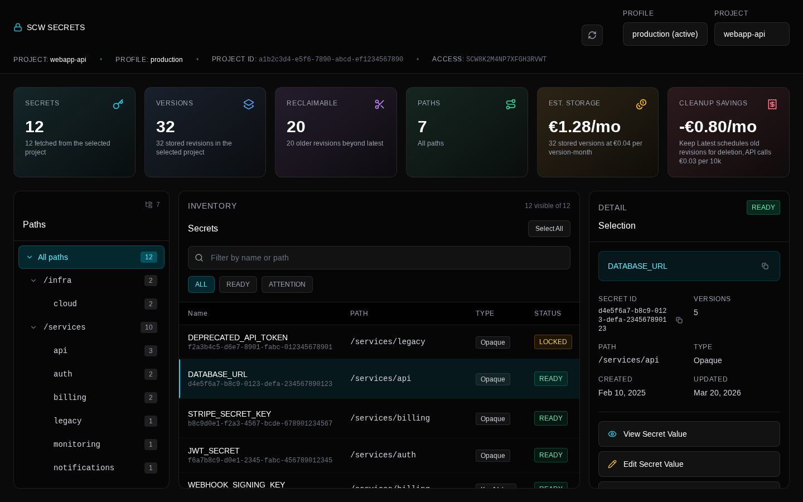

# SCW Secrets Desktop

Desktop app for browsing and managing [Scaleway Secret Manager](https://www.scaleway.com/en/secret-manager/) secrets.

Built with [Electrobun](https://electrobun.dev), React, TypeScript, and Tailwind CSS.

## Disclaimer

This project is provided as-is, with no guarantee or warranty of any kind. Use it at your own risk.



## Features

- **Profile & project switching** — reads `~/.config/scw/config.yaml` and environment variables
- **Path navigator** — browse secrets organized by path hierarchy
- **Secrets inventory** — searchable table with status and version badges, filter by status
- **Multi-select** — shift+click for range, ctrl+click to toggle, batch operations
- **View secret values** — single or batch, displayed in a full-screen overlay with copy support
- **Create secret** — create new secrets with name, path, type, value, and tags
- **Edit secret values** — modify a value and save as a new version
- **Copy as KEY=VALUE** — batch-copy selected secrets for `.env` files
- **Version history** — modal with all versions, enable/disable/destroy actions
- **Keep Latest** — prune old versions, keeping only the latest revision (single or batch)
- **Column sorting** — sort inventory by name, version count, or updated date
- **Secret types** — displayed in inventory table and detail panel
- **Cost estimates** — storage cost and potential cleanup savings in stats cards
- **Tags** — displayed in the inventory table
- **Select all** — quick button to select all visible secrets
- **Manage secret** — opens the Scaleway console for the selected secret
- **Schedule deletion** — single or batch delete with confirmation

## Setup

```bash
bun install
```

## Development

```bash
bun run dev          # Electrobun dev mode
bun run dev:hmr      # Electrobun + Vite HMR
bun run mock         # Browser preview with mock data (port 5199)
```

## Testing

```bash
bun run test         # Unit tests (bun test)
bun run test:e2e     # E2E tests (Playwright against mock mode)
```

## Build

```bash
bun run build        # Vite production build
bun run build:canary # Vite build + Electrobun canary
bun run build:stable # Vite build + Electrobun stable
bun run typecheck    # TypeScript check
```

## Project Structure

```
src/
├── bun/
│   ├── index.ts              # Electrobun main process and RPC handlers
│   └── scw.ts                # Scaleway config parsing and API client
├── mainview/
│   ├── App.tsx               # React application shell
│   ├── rpc.ts                # Typed Electrobun webview RPC setup
│   ├── main.tsx              # React entry point
│   ├── secret-list.ts        # Filtering, sorting, and selection reconciliation
│   ├── secret-versions.ts    # Version pruning plan logic
│   ├── inventory-selection.ts # Row click and select-all state helpers
│   └── components/
│       ├── Header.tsx        # Profile/project dropdowns, metadata bar
│       ├── StatsCards.tsx     # Gradient stat cards
│       ├── Navigator.tsx     # Path tree with count badges
│       ├── Inventory.tsx     # Secrets table with multi-select
│       ├── DetailPanel.tsx   # Secret detail and action buttons
│       ├── ValueModal.tsx    # Full-screen value overlay
│       ├── EditModal.tsx     # Edit secret value modal
│       ├── CreateSecretModal.tsx # Create new secret modal
│       └── HistoryModal.tsx  # Version history modal with actions
└── shared/
    ├── models.ts             # Shared types
    └── rpc.ts                # RPC contract
```
